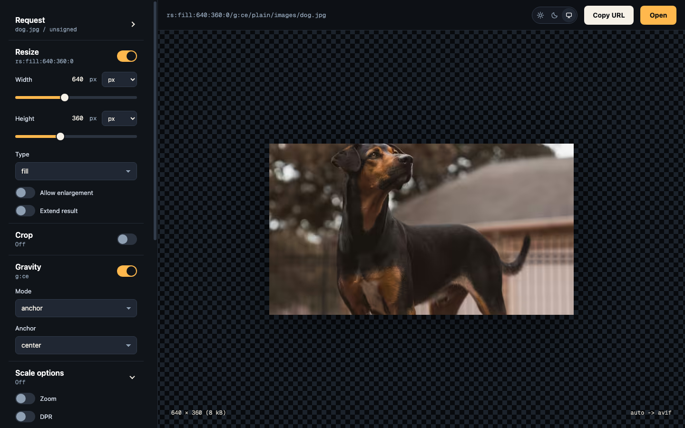

# ImagePlug

`ImagePlug` is an image optimization server, written as a `Plug`.

Uses the [image](https://hex.pm/packages/image) library under the hood.

Probably not quite ready for prime time yet.

Name not final!

## Imgproxy Path API

ImagePlug's Imgproxy API uses path-oriented and declarative URLs:

```text
/<signature>[/<option>...]/plain/<origin_path>
```

For unsigned local development, the signature segment can be `_` or `unsafe`:

```text
/_/plain/images/beach.jpg
/_/w:300/plain/images/beach.jpg
/_/rs:fill:300:300/g:ce/plain/images/beach.jpg
/_/rs:fit:800:0/f:webp/plain/images/beach.jpg
/_/rt:force/w:300/h:200/plain/images/beach.jpg
/_/rs:fill:300:300/plain/images/beach.jpg@webp
```

For production-style imgproxy compatibility, configure hex-encoded key/salt
pairs under `:imgproxy`:

```elixir
forward "/",
  to: ImagePlug,
  init_opts: [
    root_url: "http://localhost:4000",
    parser: ImagePlug.Parser.Imgproxy,
    imgproxy: [
      signature: [
        keys: ["736563726574"],
        salts: ["68656c6c6f"],
        signature_size: 32,
        trusted_signatures: []
      ]
    ]
  ]
```

When signing is configured, `_` and `unsafe` are rejected unless explicitly
listed in `trusted_signatures`. Trusted signatures are exact path-segment
matches accepted before HMAC decoding. A trusted-only configuration accepts only
those exact trusted signatures. This is intentionally narrower than upstream
imgproxy's disabled-signing behavior, which accepts any signature segment when
no key/salt pair is configured.

The Imgproxy grammar accepts selected imgproxy-compatible option names as ImagePlug's own path grammar. Compatibility ends at parsing and planning: runtime, cache, output, and transform code consume product-neutral `ImagePlug.Plan` data with canonical `ImagePlug.Plan.Operation.*` transform intent.

Options are declarative. Their order in the URL does not define processing order:

```text
/_/rs:fill:300:300/plain/images/beach.jpg
/_/h:300/w:300/rt:fill/plain/images/beach.jpg
```

Both URLs describe the same requested output. ImagePlug owns the fixed processing pipeline so it can optimize origin loading, resize, crop, and output encoding over time.

When multiple options assign the same canonical field, later assignments win. For example, `w:100/width:200` normalizes to width `200`, while `width:200/w:100` normalizes to width `100`. This affects request normalization only; it does not change transform execution order.

For the complete user-facing URL reference, see [Imgproxy Path API](docs/imgproxy_path_api.md).

For a feature-by-feature comparison with imgproxy's processing URL surface, see
[Imgproxy Support Matrix](docs/imgproxy_support_matrix.md).

For parser and dialect-author guidance on mapping URL concepts to product-neutral transform operations, see [Transform Operations](docs/transform_operations.md).

### Options

```text
resize:%resizing_type:%width:%height:%enlarge:%extend
rs:%resizing_type:%width:%height:%enlarge:%extend
size:%width:%height:%enlarge:%extend
s:%width:%height:%enlarge:%extend
resizing_type:%resizing_type
rt:%resizing_type
width:%width
w:%width
height:%height
h:%height
min-width:%width
mw:%width
min-height:%height
mh:%height
zoom:%x:%y
z:%x:%y
dpr:%ratio
enlarge:%boolean
el:%boolean
extend:%boolean
ex:%boolean
extend_aspect_ratio:%width:%height
extend_ar:%width:%height
exar:%width:%height
gravity:%type:%x_offset:%y_offset
g:%type:%x_offset:%y_offset
crop:%width:%height:%gravity:%x_offset:%y_offset
c:%width:%height:%gravity:%x_offset:%y_offset
auto_rotate:%boolean
ar:%boolean
rotate:%angle
rot:%angle
flip:%horizontal:%vertical
flip:%horizontal
flip
fl:%horizontal:%vertical
fl:%horizontal
fl
quality:%quality
q:%quality
format_quality:%format:%quality
fq:%format:%quality
format:%extension
f:%extension
ext:%extension
cachebuster:%value
cb:%value
expires:%unix_seconds
exp:%unix_seconds
filename:%name:%encoded
fn:%name:%encoded
return_attachment:%boolean
att:%boolean
plain source @extension
```

Recognized resizing types are `fit`, `fill`, `force`, `auto`, and `fill-down`. `auto` maps to a semantic resize operation with `mode: :auto`; the selected fit/cover branch is derived after a cache miss from the current dimensions at that point in the Plan. Width and height values are pixel dimensions; `0` means unconstrained when accepted by the selected option.

Supported gravity values are the imgproxy compass anchors, `ce`, `no`, `so`, `ea`, `we`, `noea`, `nowe`, `soea`, `sowe`, focal point `fp:%x:%y`, and smart gravity `sm`. Smart gravity parses but is not planned in this slice.

`quality` and `format_quality` configure output encoding. `cachebuster` changes cache key data. `expires` is request validity policy. `filename` and `return_attachment` configure response delivery. These options are not transforms and do not add image pipeline operations.

Supported explicit output extensions are `webp`, `avif`, `jpeg`, `jpg`, `png`, and `best`. `jpg` normalizes to JPEG. `best` parses but is not planned in this slice.

Dropped imgproxy options for this slice, including `raw`, `max_bytes`, `max_src_resolution`, `max_src_file_size`, and `crop_aspect_ratio`, are not accepted by the Imgproxy grammar.

The first `plain` segment terminates option parsing. Later path segments are treated as the origin path, even if they look like options.

Omitting an explicit output format enables automatic output selection. ImagePlug defaults automatic AVIF and WebP selection to enabled. `Accept` is used to detect optional modern format support; if no enabled modern format is detected, ImagePlug uses the source image format. Automatic output responses use `Vary: Accept`. Explicit `format`, `f`, `ext`, and plain-source `@extension` bypass `Accept` negotiation and do not set `Vary: Accept`.

ImagePlug emits `Content-Disposition` for successful image responses. When `filename` is omitted, the imgproxy-compatible parser derives a filename stem from the source path before response sending appends the resolved output extension. `return_attachment:true` emits an attachment disposition, `return_attachment:false` emits inline, and omission uses the configured default disposition.

## Usage example

```elixir
defmodule ImagePlug.SimpleServer do
  use Plug.Router

  plug Plug.Static,
    at: "/",
    from: {:the_app_name, "priv/static"},
    only: ~w(images)

  plug :match
  plug :dispatch

  match "/images/*path" do
    send_resp(conn, 404, "404 Not Found")
  end

  forward "/",
    to: ImagePlug,
    init_opts: [
      root_url: "http://localhost:4000",
      parser: ImagePlug.Parser.Imgproxy
    ]
end
```

The repository includes a dev-only simple server for local testing:

```sh
mise exec -- mix image_plug.server
mise exec -- mix image_plug.server --port 4001
mise exec -- mix image_plug.server --cache
```

The simple server runs without cache by default. Pass `--cache` to enable the filesystem cache
under `_build/dev/image_plug/cache`, or `--no-cache` to make the disabled state explicit.

The simple server also serves a dev-only demo fiddle at `/demo`. The fiddle is a
small Svelte/Vite UI for changing common path options and previewing the
generated SimpleServer request. Starting `mix image_plug.server` also starts the
Vite dev server on `http://localhost:5173`, while the demo itself remains
available through the simple server:

```sh
mise exec -- mix image_plug.server
open http://localhost:4000/demo
```



Pass `--no-vite` to run only the image server without the demo asset server:

```sh
mise exec -- mix image_plug.server --no-vite
```

## Filesystem Cache

ImagePlug can cache complete encoded responses after successful processing:

```elixir
forward "/",
  to: ImagePlug,
  init_opts: [
    root_url: "http://localhost:4000",
    parser: ImagePlug.Parser.Imgproxy,
    cache:
      {ImagePlug.Cache.FileSystem,
       root: "/var/cache/image_plug",
       path_prefix: "processed",
       # Encoded response cache storage limit, separate from the top-level origin fetch limit.
       max_body_bytes: 10_000_000,
       key_headers: [],
       key_cookies: [],
       fail_on_cache_error: false}
  ]
```

Cache lookup happens only after the request parses, the pipeline plans, and the origin identity/freshness data is resolved. It does not fetch, decode, or read metadata from the origin image. Invalid parser and planner requests return `400` before origin or cache access; invalid imgproxy signatures return `403`. Parser, planner, origin fetch, decode, transform, negotiation, and encode errors are never cached.

Cache keys include resolved origin identity/freshness data, canonical Plan operation key data, the cache key's transform key data version, configured `:key_headers` and `:key_cookies`, and normalized automatic-output inputs when output is automatic: detected modern output candidates plus `:auto_avif` / `:auto_webp` flags. They exclude request signatures, raw request paths, query strings, raw `Accept` headers, source metadata, decoded image properties, source-aware execution choices, and unconfigured headers or cookies. Key data includes a schema version and deterministic primitive serialization. Explicit formats bypass `Accept` negotiation and therefore do not vary by `Accept`.

Cached response headers are restricted to `vary` and `cache-control`. Header names are normalized to lowercase, and duplicate allowed headers are preserved.

`ImagePlug.Cache.FileSystem` requires an absolute `:root`. The optional `:path_prefix` must be relative and rejects backslashes, duplicate-slash empty segments, `.`, `..`, and `~`-prefixed path segments. Cache paths are derived from generated hashes, not from request, origin, header, or cookie data.

Filesystem metadata has an independent `metadata_version` and includes the cached body filename, byte size, and SHA-256 digest. Body files are content-addressed by digest, and the metadata file is the atomic commit record. Overwrites or failed metadata commits can leave unreferenced body files behind; those are safe misses, not corrupt entries. Missing files, invalid metadata, and default filesystem read problems are cache misses by default. With `fail_on_cache_error: true`, invalid metadata and filesystem read problems become cache read errors.

Adapter errors returned to the cache coordinator fail open by default and are logged. Set `fail_on_cache_error: true` to fail closed with a `500` cache error instead. Invalid cache configuration is rejected during Plug initialization. Encoded response bodies over the cache `:max_body_bytes` are returned to the client but skipped for cache storage. `:max_body_bytes` must be `nil` or a non-negative integer.

Treat the cache root as trusted local configuration. Generated paths are validated to stay under the configured root, but the filesystem adapter does not defend against a local actor replacing directories inside the root with symlinks.

## Operational Notes

`ImagePlug` verifies imgproxy signatures and parses imgproxy path options before fetching the origin image. Invalid signatures return `403`, and invalid processing requests return `400`, both without origin traffic.

Origin fetches use non-bang Req calls with bounded redirects, receive timeout, and a maximum response body size. The source format is read from the decoded image rather than trusted HTTP headers. Configure these with `:origin_max_redirects`, `:origin_receive_timeout`, `:max_body_bytes`, and `:max_input_pixels`.

For transform chains that are proven to be safe for one-pass reads, ImagePlug may open the origin image with libvips sequential access before resizing. The first supported shapes are fit/force resize requests with concrete target dimensions; these shapes may use sequential access whether the result downscales or upscales. Chains involving crop, cover/fill result crops, canvas extension, unknown transforms, output-only requests, or no geometry transform continue to use random access.

When a parsed plan contains multiple image pipelines, ImagePlug materializes the image between pipelines. This preserves the explicit pipeline boundary and lets origin decode planning consider the first pipeline only: later pipelines may contain operations that ImagePlug classifies as requiring random access, and those operations should run against a memory-backed intermediate image instead of changing how the origin image is opened.

Sequential decode does not use JPEG shrink-on-load or WebP scale hints in this pass. Origin byte limits, receive timeouts, decoded pixel limits, and decode error responses still apply. Cache hits serve stored response bodies directly and do not participate in origin decode optimization.

Automatic output format selection uses the request `Accept` header only to detect optional modern format support. `q=0` excludes AVIF/WebP candidates, including exact media-type exclusions over wildcard allowances. Among detected modern candidates, ImagePlug uses server preference order rather than relative q-value ordering. If no enabled modern candidate is detected, ImagePlug uses the source image format. Automatic output responses use `Vary: Accept`. Explicit formats bypass content negotiation and do not set `Vary: Accept`.
