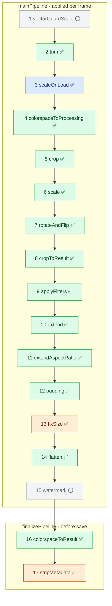

# Imgproxy support matrix

This matrix compares ImagePipe's current `ImagePipe.Parser.Imgproxy` support
with Imgproxy's processing URL and configuration surfaces.

ImagePipe intentionally treats Imgproxy URLs as a compatibility parser for a
product-neutral `ImagePipe.Plan`. Supported options translate cleanly into
canonical plan/output/cache/response fields. Unsupported options fail before
source fetch or cache lookup. ImagePipe doesn't ignore them.

Conformance has three axes. This document covers two of them; the third lives in
the test suite:

| Axis | Question | Where |
| --- | --- | --- |
| **Surface** | Do we accept the same URL options / config? | the option/config tables below |
| **Stage / order** | Do we run the same processing stages, in a compatible order, realized where? | [Processing pipeline conformance](#processing-pipeline-conformance) |
| **Behavioral / pixel** | Does a matching stage produce matching output? | wire conformance tests (`test/image_pipe/imgproxy_wire_conformance_test.exs`) + the "Diverges" notes throughout |

A single feature can pass one axis and fail another: `fixSize` (in the pipeline
section) is *surface*-invisible (no option/config), *stage*-conformant, and
*behaviorally* equivalent for WebP/AVIF — it only becomes legible on the stage
axis. References to imgproxy source below use imgproxy's own repository layout
(`processing/…` in `github.com/imgproxy/imgproxy`); ImagePipe doesn't vendor it.

## Processing pipeline conformance

imgproxy processes each image through a fixed, ordered pipeline. Most stages have
no env var and no URL option, so they have no row in the configuration/URL tables
below — yet they are exactly where compatibility lives. This section maps each
imgproxy stage onto the ImagePipe layer that realizes it.

ImagePipe doesn't execute imgproxy's pipeline directly: it parses to a
product-neutral `ImagePipe.Plan` whose transform order is fixed by the
parser/plan layer (URL option order is irrelevant — see
[transform_operations.md](transform_operations.md) and
[imgproxy_path_api.md](imgproxy_path_api.md)), then executes that plan across
three layers — **decode planning**, the **transform chain**, and the **output
boundary**. The diagram colours stages by which layer realizes them; the tables
carry the detail.

**Colour = ImagePipe layer:** 🟦 decode planning · 🟩 transform chain · 🟧 output
boundary (clamp / encoder finalize) · ⬜ not realized.
**Emoji = conformance:** ✅ matches · ⚠️ diverges · ⭕ missing (in scope, not built).

### Main pipeline

imgproxy's `mainPipeline` (`processing/processing.go`), applied per frame:

| # | imgproxy stage | Realized in ImagePipe | Status | Notes |
| --- | --- | --- | --- | --- |
| 1 | `vectorGuardScale` | — | ⭕ | Gated on SVG/vector input support, which isn't implemented yet (SVG is rejected after decode identifies an SVG loader, before transforms). In scope; this pre-scale stage follows once SVG input lands. (see "Source input formats") |
| 2 | `trim` | `lib/image_pipe/transform/operation/trim.ex` | ✅ | Replicates imgproxy `vips_trim`: (1) colourspace-convert to sRGB for detection; (2) flatten alpha onto magenta `{255,0,255}` before detecting; (3) smart bg = top-left pixel `getpoint(0,0)` of the prepared image; (4) `find_trim` to locate the border box; (5) equal_hor / equal_ver symmetrization — each pair of opposite margins is made equal to the *smaller* inset (trims less aggressively, symmetrically); (6) degenerate box (`width==0 \|\| height==0`) → image returned **unchanged**; (7) extract from the **original** image, preserving its colorspace/alpha. Materializing op (`requires_materialization?: true`). **Storage-frame under deferred orientation (stage/order, [#182](https://github.com/hlindset/image_pipe/issues/182)):** imgproxy trims at stage 2, *before* `rotateAndFlip` (stage 7), so the trim box is computed on **un-oriented** pixels. ImagePipe defers EXIF/user orientation to a late flush, so for an oriented source trim materializes the storage frame to RAM **without** applying the pending orientation (`Materializer.materialize_without_orientation/1`), runs `find_trim`/crop there, and leaves the orientation for the boundary flush. This keeps the two frame-sensitive inputs storage-frame to match imgproxy: the smart `getpoint(0,0)` background is sampled at the **storage** top-left corner (not the rotated display corner), and `equal_hor`/`equal_ver` symmetrize the **storage** axes (which transpose vs the display axes under EXIF 5–8). A plain uniform-border trim commutes with rotation and is unaffected. **Disables shrink-on-load when in the first pipeline** (mirrors imgproxy nil-ing `ImgData` at stage 2, before `scaleOnLoad` at stage 3). Trim in a later pipeline does not disable pipeline-1 scale-on-load. Trim's detection inherits working-space pixels because the input color preamble (`lib/image_pipe/transform/input_color_management.ex`) runs before all operations — pixel-equivalent to imgproxy calling `colorspaceToProcessing` inside `vips_trim`. **Minor bounded divergence — sRGB-skip uses stored header interpretation**, not imgproxy's `guess_interpretation`: at most an extra idempotent sRGB round-trip, no dimension effect (see stage 4 notes). |
| 3 | `scaleOnLoad` | **decode planning** — `lib/image_pipe/transform/decode_planner.ex` | ✅ | Shrink-on-load computed as a libvips load option (`shrink`/`scale`), not a transform op. Decode opens `:sequential`. The realized factor (`decode_shrink`) and stored extent (`source_dimensions`) are **confined to the pipeline whose decode produced them** — a preceding crop and the residual resize each clear them, so an absolute crop in a later chained (`/-/`) pipeline is sized against that pipeline's input, not rescaled by a stale factor (#180). This matches imgproxy Pro chained pipelines (`IMGPROXY_MAX_CHAINED_PIPELINES`): each pipeline is a full processing pass over the previous pipeline's in-memory output, so `scaleOnLoad`'s preshrink factor (`scale_on_load.go`) exists only for the initial decode and never carries into a later pipeline. |
| 4 | `colorspaceToProcessing` | `lib/image_pipe/transform/input_color_management.ex` (fixed preamble) | ✅ | ImagePipe imports **every** profiled/wide-gamut/CMYK source to a working space (sRGB for 8-bit; B_W for greyscale) via a fixed preamble in `PlanExecutor.execute/3`, unconditionally, before trim and all geometry — regardless of `scp`. Mirrors imgproxy `colorspaceToProcessing`: import gating (has profile, not canonical sRGB-IEC61966, UCHAR/USHORT coding), PCS sniff, 16-bit-alpha band split/rejoin, and linear-source skip (scRGB). For untagged/already-sRGB inputs the preamble is a no-op. **Minor bounded divergence (stage/order):** ImagePipe's working-space chooser and sRGB-IEC61966 skip read the **stored** libvips interpretation (header), where imgproxy uses `vips_image_guess_interpretation` for those same checks. For all normally-decoded sources — the full conformance suite — the stored and guessed interpretations agree; they can diverge only for atypical inputs whose stored interpretation is unset or MULTIBAND. The working-space chooser now consumes the resolved HDR policy (`Format.supports_hdr?(format)` and `Plan.Output.hdr == :preserve`), threaded as a pre-transform `supports_hdr?` boolean from the Request/Output boundary; previously hardwired SDR (the #121 seam). For 16-bit sources this keeps RGB16/GREY16 when the format carries HDR, else collapses to sRGB/B_W. **Differential coverage (behavioral/pixel):** the `cmyk_import` case pixel-conforms the unconditional CMYK→sRGB import against the OSS bake (a 120×90 CMYK JPEG under a no-op `rs:fit:200:200`, isolating the import with no resampling — maxΔ 0). Distinct from `cp:cmyk` CMYK *output* targeting (#214). |
| 5 | `crop` | `lib/image_pipe/transform/operation/crop.ex` | ✅ | Pre-resize crop with anchor / focal-point / smart / object gravity. |
| 6 | `scale` | `lib/image_pipe/transform/operation/resize.ex` | ✅ | `fit`/`fill`/`fill-down`/`force`/`auto`, enlarge, min-width/height, zoom, dpr. Pro `resizing_algorithm` (`ra`) missing. The fit/fill ratio, zoom, and dpr fold into a **single** `imath.Scale` per axis (`round(source × scale)`, one round — `prepare.go` `calcScale`/`calcSizes`), not a fit-round then a dpr-multiply; on a fractional fit dimension this matches imgproxy exactly (`rs:fit:300:200/dpr:2` on 1600×1200 → 533×400, and the dpr=1 auto-axis `rs:fit::200` enlarge → 183×200) (#199). **`auto` fill-vs-fit (behavioral, #233):** `rt:auto` buckets by the **sign** of the source/target width−height difference (`prepare.go:88-97`), with a square dimension (`D == 0`) sharing the non-negative (landscape) bucket; cover fills only when both source and target land in the same bucket, else fit. So square↔landscape pairs fill (cover + result-crop) rather than fit — `auto_resize_square_target_marker` (landscape→square) and `auto_resize_square_source_icc` (square→landscape) pin both directions. **`rt:auto` classified in the display frame (stage/order, [#182](https://github.com/hlindset/image_pipe/issues/182)):** that sign comparison runs on **display-frame** source dims — imgproxy's `ResizeAuto` swaps `srcW`/`srcH` via `ExtractGeometry` for a quarter turn *before* comparing (`prepare.go`). Under deferred orientation ImagePipe classifies the fill-vs-fit branch (and the no-enlarge effective-DPR padding-scale cap) against the display-frame source dims (`display_source_dims/1` swaps the storage axes for a pending quarter turn), so an EXIF 5–8 / `rot:90`/`270` source is not judged on transposed axes and does not pick fit where imgproxy picks fill. |
| 7 | `rotateAndFlip` | `.../transform/pending_orientation.ex`, `.../transform/orientation_flush.ex`, `.../transform/orientation.ex`, `.../operation/rotate.ex`, `.../operation/flip.ex` | ✅ | EXIF auto-orient + user rotate/flip are carried as deferred `pending_orientation` state and applied **late** at the orientation-flush boundary — **after** crop/resize, with crop gravity and resize dimensions compensated into the storage frame (`orientation.ex`, a port of imgproxy `gravity.go` `RotateAndFlip`) so the observable result matches. Compose suborder EXIF → user-rotate → user-flip; EXIF auto-orient is the default. Flush streams EXIF orientations 1/2 and materializes 3–8 (and any quarter/half-turn user rotate or vertical flip). The same storage↔display compensation extends to shrink-on-load: a gravity crop carrying a pending quarter turn swaps the storage-frame `decode_shrink` per-axis factors before rescaling its display-frame dims (#185). imgproxy rescales crop dims in the **display** frame (its `SrcWidth`/preshrink are `ExtractGeometry`-swapped — `prepare.go`); ImagePipe reaches the same result by swapping the storage-frame factors ahead of the quarter-turn crop swap. **EXIF coverage:** the differential suite exercises all eight EXIF orientations — including the flip∘quarter-turn compose paths (transpose 5 / transverse 7) that a lone orientation-6 quarter-turn could not reach. imgproxy derives angle and flip for all eight orientations in `angleFlip` (`prepare.go`) and sequences EXIF rotate → EXIF flip → user rotate → user flip in `rotateAndFlip` (`rotate_and_flip.go`); ImagePipe follows the same compose order. **Rotation primitive (behavioral):** both the deferred user rotate (`orientation_flush.ex`) and the executable `Operation.Rotate` apply the exact `vips_rot` (the same primitive `autorotate` runs for EXIF), not libvips' arbitrary-angle affine resampler — the affine path leaves a 1px black edge seam even for 90° multiples (#211). This makes the flip∘quarter-turn ∘ user-`rot:90` compose (transpose 5 / transverse 7) pixel-exact at the frame and block edges, matching imgproxy's vips_rot orientation (`exif_5_cover_rot90`, `exif_7_cover_rot90`). |
| 8 | `cropToResult` | `lib/image_pipe/transform/operation/crop.ex` (result crop after a resize) | ✅ | `Resize` deliberately does **not** crop; plan execution emits a **separate** result crop to the requested box (gravity center, bounded to the image — imgproxy `MinNonZero`). The crop box is the **literal requested dimensions** (`result_box_*`, not the min-expanded target — imgproxy's universal `cropToResult` crops to `ResultCropWidth/Height = TargetWidth/Height = Scale(po.Width, DprScale·Zoom)`), so the min-dimension guarantee survives on the short axis while the overflowing axis is trimmed back to what was asked for. For `fill`/`fill_down` the cover resize always overflows the box, so the crop always fires (`cover_resize_and_crop`, and the quarter-turn `cover_resize_and_crop_display_frame`, both crop to `result_box_*`). For `fit` the scaled image normally fits inside the box and no crop is emitted — **except** when `mw`/`mh` force a min-dimension upscale past the box on an axis (e.g. `rs:fit:300:300/mw:280/mh:280` on 1600×1200 → scale 373×280, crop to 300×280, #194; cover arm `rs:fill-down:200:200/mw:400/mh:400` on 1600×1200 → 200×200, #236). The `mw`/`mh` > target regime is pinned by the `fill_down_min_dims_marker` and `fill_mw_mh_above_target` cover probes (the existing `cover_min_dims_marker` has `mw`/`mh` *below* the target, so it is inert). |
| 9 | `applyFilters` | `lib/image_pipe/transform/operation/{blur,sharpen,pixelate,brightness,contrast,saturation,monochrome,duotone}.ex` | ✅ | Supported effect subset; order documented in [transform_operations.md](transform_operations.md). Only **blur / sharpen / pixelate** are OSS (imgproxy's `apply_filters.go` applies exactly these three) and thus differentiable against the OSS bake; **brightness / contrast / saturation / monochrome / duotone are imgproxy-Pro** — ImagePipe-implemented features exposed through the dialect, not OSS parity (no wire-diff; see the option table) — so they are *not* differential gaps. Pro filters `unsharp_masking`, `blur_areas`, `colorize`, `gradient` are entirely missing. **Differential coverage (stage/order):** the OSS subset's fixed order — imgproxy `vips.c` `apply_filters` runs blur → sharpen → pixelate, which `effect_operations` matches — is pinned end-to-end by `effects_chain_order_high_freq` (`bl:2/sh:2/pix:8` stacked; a reordered chain would diverge grossly), alongside the isolated `pixelate_marker`, `blur_zone`, and `sharpen_zone` cases. **Pixelate kernel (behavioral, [#238](https://github.com/hlindset/image_pipe/issues/238)):** pixelate downsamples with `vips_shrink` (a pure box mean) + `vips_zoom` (nearest enlarge), matching imgproxy's `vips.c` `apply_filters` exactly — the mirror-embed-to-integer-multiple preamble makes the shrink an exact integer factor, vips_shrink's domain. A box mean is bounded by the source range, so it cannot ring/overshoot the way libvips' default Lanczos resize kernel does at sharp edges; `pixelate_marker`, `effects_chain_order_high_freq`, and `exif_182_pixelate` are now byte-identical (maxΔ=0). **Display frame under deferred orientation (stage/order, [#182](https://github.com/hlindset/image_pipe/issues/182)):** `applyFilters` runs at stage 9, *after* `rotateAndFlip` (stage 7). Blur/sharpen commute with right-angle rotation, but pixelate's block grid does not (a non-multiple size leaves partial edge blocks that must land on the **display** edge). When pixelate runs with an orientation still pending — the resize-less path; any resize would already have flushed — ImagePipe flushes the pending orientation first so the grid aligns to the display frame. |
| 10 | `extend` | `lib/image_pipe/transform/operation/extend_canvas.ex` | ✅ | Canvas extension with anchor gravity and offsets. Non-alpha sources gain an opaque alpha and the padding is transparent black `(0,0,0,0)` (imgproxy `vips_embed_go`: `addalpha` + `VIPS_EXTEND_BLACK`). Centered placement uses imgproxy's `calc_position.go` origin `ShrinkToEven(outer − inner + 1, 2)` — the same center origin as the result crop — **not** a floor of `(outer − inner)/2`, which slipped the content 1px on an odd gap (#195). **DPR scaling:** the extend target box (`TargetWidth = Scale(width, DprScale)`, `prepare.go`) and absolute offsets (`offX = RoundToEven(offset × DprScale)` for `|offset| ≥ 1`, `calc_position.go`) both scale by the effective DPR; the executor threads the resize's **composition-preserving** scale into the canvas op (the same `:canvas_preserving` scale padding uses, which — like imgproxy's `prepare.go:136` — skips the enlarge-off DprScale compensation so the extend composition stays dpr-stable). Zoom is not folded into that scale (a bounded limitation shared with padding). **Offset placement matches `calc_position.go`:** west/north/center add the offset, right/bottom anchors move the image *away* from the anchored edge (`left = outer − inner − offX`), and the resolved origin clamps to `[0, outer − inner]` (allowOverflow=false) (#200). **Inert no-op ([#220](https://github.com/hlindset/image_pipe/issues/220)):** when the extend resolves to *no actual padding* (the resized image already fills the requested canvas and any offset clamps to zero), the embed is skipped and the image is left untouched — matching imgproxy's `extendImage()` early return (`width <= imgWidth && height <= imgHeight`), so a non-alpha source stays 3-band instead of gaining a spurious alpha channel. |
| 11 | `extendAspectRatio` | `lib/image_pipe/transform/operation/extend_canvas.ex` (`{:aspect_ratio, ratio}` rule) | ✅ | `extend_ar`/`exar`; no-op when a resize dimension is auto/zero. `fp` extend-gravity not supported. Shares the stage-10 centered-placement parity (#196). The AR canvas box is image-relative (computed from the already-dpr-scaled image), so it needs no separate DPR scaling; it inherits the stage-6 single-round scale, so a fractional fit dimension under `dpr` lands at imgproxy's width (`rs:fit:300:200/exar:1/dpr:2` → 533 centred in the 600×400 canvas, #199). |
| 12 | `padding` | `lib/image_pipe/transform/operation/padding.ex` | ✅ | CSS-style shorthand, effective DPR scaling. **Display frame under deferred orientation (stage/order, [#182](https://github.com/hlindset/image_pipe/issues/182)):** padding runs at stage 12, *after* `rotateAndFlip` (stage 7), so `pt`/`pr`/`pb`/`pl` land on **display** sides. imgproxy `padding` does not require `w`/`h`, so "EXIF-rotated source + asymmetric padding, no resize" is reachable; with a resize present the resize-triggered flush already fires first, but the resize-less path needs the op to flush the pending orientation before padding. ImagePipe does so, so asymmetric padding lands on the display sides regardless of whether a resize is present. (Symmetric padding masks the difference; `ExtendCanvas`/`extend` is incidentally protected because `extend` requires `w`/`h`, forcing a resize and therefore a flush.) **No-enlarge effective-DPR cap (behavioral, [#237](https://github.com/hlindset/image_pipe/issues/237)):** imgproxy's `!Enlarge()` block *always* runs `DprScale = min(DPR, min(wshrink, hshrink))`, so a geometry-less dpr (`pd:…` + `dpr`, no `w`/`h` — which still emits a no-op `auto/auto` resize) caps `DprScale` to 1 (`wshrink=hshrink=1`) and leaves padding unscaled (`pd:10:4:2:8/dpr:2` on a 300×400 display → 312×412). ImagePipe's cap (`max_padding_scale_without_enlarge`) returns the real `1.0` for the `auto/auto` requested box rather than treating it as uncapped, matching imgproxy on both the resize-bearing (`exif_182_auto_pad_dpr_cap`) and resize-less (`padding_asym_dpr_exif`) arms. |
| 13 | `fixSize` | **output boundary** — `lib/image_pipe/output/clamp.ex` (#150) | ✅ | Format-aware encoder dimension clamp. Realized at the **Output boundary**, not the transform chain: the realized image is uniformly downscaled to the chosen encoder's hard limit (WebP 16383, AVIF 16384). Mirrors imgproxy's `processing/fix_size.go` (`fixWebpSize`/`fixHeifSize`). Emits `[:output, :clamp]` ([telemetry.md](telemetry.md)); covered by the wire conformance tests. The host `max_result_*` caps fold into this same clamp via `min(host, encoder)` (#165); ImagePipe's result-pixel cap uses an **independent linear-dimension + sqrt-pixel** rule, deliberately **not** `fixGifSize`'s combined-sqrt (which can leave a result over the dimension limit). |
| 14 | `flatten` | `lib/image_pipe/transform/operation/background.ex` | ✅ | Alpha flatten onto `background`/`background_alpha` (`bg`/`bga`); default black. |
| 15 | `watermark` | — | ⭕ | In scope, not yet implemented (consistent with the watermark rows in "Background, effects, and overlays" and "Watermark defaults and custom watermark cache"). |

### Finalize pipeline

imgproxy's `finalizePipeline` (`processing/processing.go`), applied before save:

| # | imgproxy stage | Realized in ImagePipe | Status | Notes |
| --- | --- | --- | --- | --- |
| 16 | `colorspaceToResult` | **encoder finalize** — `lib/image_pipe/output/encoder.ex` (`color_result`) | ✅ | The encoder finalize state machine reads `Plan.Output.color_profile` (`:preserve_source`, `:strip`, or `{:convert, target}`) and the `imagepipe-icc-imported` / `imagepipe-icc-backup` fields stamped by the delivery seam: when `:preserve_source` + imported + format supports profiles, re-export to the restored source profile (`icc_export`); when `:strip` + imported, the image is already in the working space — drop the profile; when neither side imported (untagged/sRGB source), convert-to-standard (`icc_transform`) is a no-op. **Target conversion (`cp`/`icc`):** `{:convert, target}` runs `convert_to_target` here — working-space sRGB → the named built-in profile via `icc_transform`, embedding the target (greyscale promoted to sRGB first); it overrides `scp` (a converted target is embedded, never stripped) and reuses this same finalize seam (no new stage). **Format-ignored parity:** imgproxy ignores `cp` when the output format can't carry a profile; ImagePipe's `convert_to_target` returns the image un-embedded when `Format.supports_color_profile?` is false — vacuous for the four current formats (all carry profiles), load-bearing once CMYK (#214) lands. Always unconditional — matches imgproxy `colorspaceToResult` running before save regardless of `scp`. **Profile-drop field list (behavioral):** when the profile is dropped (`scp:1`/default, no `cp`), `maybe_drop_profile` removes the exact field set imgproxy's `vips_icc_remove` strips — the ICC blob **and** three EXIF color-characterization tags (`exif-ifd0-WhitePoint`, `exif-ifd0-PrimaryChromaticities`, `exif-ifd2-ColorSpace`) — and does so independent of `sm`, so they are stripped even under `sm:0`. imgproxy's internal `imgproxy-icc-profile` carry has no ImagePipe analogue to remove (ImagePipe's private `imagepipe-icc-*` carry fields are stripped at stage 17). **Bounded non-divergence:** of the three, only `WhitePoint`/`PrimaryChromaticities` are output-observable; libvips reconstructs `exif-ifd2-ColorSpace` from the encoded image's color interpretation on JPEG write, so it reappears identically on both imgproxy and ImagePipe output. |
| 17 | `stripMetadata` | **encoder finalize** — `lib/image_pipe/output/encoder.ex` | ✅ | Strips EXIF/XMP/IPTC at encode, after the stage-16 color-result step completes. **Diverges** on `keep_copyright` (preserves EXIF copyright/artist only; imgproxy keeps full XMP/IPTC). ICC handling is owned by stage 16; the strip runs after re-embed or drop. See "Metadata, color, and source decoding". |

### Surrounding stages

imgproxy wraps the pipelines with load, size-gating, format determination, and
save. ImagePipe realizes these at request and output boundaries:

| imgproxy stage | Realized in ImagePipe | Status | Notes |
| --- | --- | --- | --- |
| Initial load + source-resolution gate (`MaxSrcResolution`) | decode + `max_input_pixels` (hard error) | ✅ | The image-bomb gate is a hard error, not a downscale — matches imgproxy. `max_body_bytes` caps the fetched body. |
| Output format determination | `lib/image_pipe/output/negotiation.ex`, `lib/image_pipe/output/policy.ex` | ✅ | `Accept` negotiation for AVIF/WebP with `Vary: Accept`; explicit `@extension`/`.extension` bypasses it. JXL, `enforce_*`, `preferred_formats` missing. |
| Host result-dimension cap (`limitScale`, `processing/prepare.go`) | `lib/image_pipe/output/clamp.ex` via the producer (`min(host max_result_*, encoder_limit)`) | ✅ | imgproxy downscales the result to fit `max_result_*`; ImagePipe matches for the common no-padding/no-extend request (#165), reusing the #150 `Output.Clamp` — byte-intent identical to `limitScale`'s linear `downScale = maxResultDim/max(outW,outH)` (`prepare.go:247`) when caps are equal and a dimension binds. **Diverges (superset):** ImagePipe honors independent `max_result_width`/`max_result_height` and a result `max_result_pixels` cap (sqrt), where imgproxy's `limitScale` has a single `MaxResultDimension` and no result-pixel cap. **Diverges (composition):** ImagePipe clamps the **composited** final image, whereas imgproxy folds the downscale into the resize scale and re-applies padding/extend at the reduced scale (`prepare.go:233-263`) — both land ≤ cap, but padded/extended requests differ in the **content-to-padding ratio of the final frame**. ImagePipe mirrors imgproxy's per-axis sub-1px floor (`prepare.go:252-258`) via `max(scale, 1/dim)`; in the extreme-aspect 1px regime the realized pixels can still differ for the same composited-vs-fold-back reason. **Stage/order (#164, approach A):** on the plain (non-oriented) path the clamp runs on the lazy composite *before* the delivery materialization, so libvips fuses resize→clamp (also crop→clamp and embed→clamp — verified across fit, cover, and canvas/padding by the #164 benchmark probes) and avoids forming the full oversized intermediate. Served output is unchanged (pixels, dims, content-type, status, cache key, ETag) and the `[:output, :clamp]` event's metadata is identical — an internal memory optimization. (One ordering nuance: the clamp event now fires *before* the delivery materialize, so it can precede a rare materialize-failure 415 where it previously would not — it never changes served output.) The oriented mid-chain flush still materializes pre-clamp (deferred). |
| Save / encode | `lib/image_pipe/output/encoder.ex` | ✅ | Streams the encoded result. Advanced/codec-specific encoder knobs missing (see "Advanced encoder options"). |

### Key takeaways

- **Order is plan-owned, not URL-owned** — imgproxy's stage order is realized by
  ImagePipe's fixed `ImagePipe.Plan` transform order; URL option order doesn't
  define it.
- **Not every imgproxy stage is a transform op** — `scaleOnLoad` is decode
  planning, `fixSize` is the output boundary, `stripMetadata`/`colorspaceToResult`
  are encoder finalize. The "Realized in" column is the map.
- **Color management (#124) is resolved.** Stages 4 and 16 are now ✅: every
  input is unconditionally imported to a working space before trim and geometry
  (`InputColorManagement` preamble), and the encoder finalize re-embeds or drops
  the source profile per `Plan.Output.color_profile`. The host result cap
  downscales to match imgproxy (#165), with a deliberate, strictly-safe superset:
  independent per-axis width/height + a result-pixel cap, and a composited-image
  clamp point. A minor bounded divergence remains at stage 4: the working-space
  chooser and sRGB-IEC61966 skip use the stored header interpretation rather than
  imgproxy's `guess_interpretation` — agreement for all normally-decoded sources,
  potential divergence only for atypical MULTIBAND/unset inputs (see stage 4 notes).
  Everything else either matches or is an explicitly missing/out-of-scope surface
  documented in the tables below.

## Differential conformance

`test/image_pipe/imgproxy_differential_conformance_test.exs` compares ImagePipe's
decoded pixel output against committed fixtures generated from a pinned real imgproxy
(`mix imgproxy.gen_fixtures`). It is the **behavioral/pixel** enforcement of this
matrix: each constellation carries a verdict that maps to a stage row.

- **`:equal`** (transform group, ✅ stages): tight count-based pixel agreement on PNG
  output against the fixtures' libvips (tolerances absorb minor libvips-version
  resampling differences). Stages exercised: trim (sRGB),
  scaleOnLoad (JPEG/WebP), crop, scale (fit/fill/fill-down/auto), rotate, extend,
  extendAspectRatio, padding, flatten, applyFilters (blur/sharpen), stripMetadata.
- **`:diverges`** (⚠️ rows): asserts a *structured* divergence still holds (region
  mean-delta ≥ floor), so an accidental convergence fails and forces a verdict flip
  here + a matrix update. The former colorspace #124 (`scp:0`) and trim-detection
  divergences have converged and moved to the `:equal` group.
- **lossy group**: dimension + content-type contract only (independent encoders), no
  pixel claim.
- **Combination constellations**: a focused set crossing option intersections the
  isolated cases don't (extend+offset+dpr, exar+dpr, min-dims+dpr, fit+min-dims+gravity,
  cover+min-dims, padding+dpr). **EXIF orientation constellations** exercise all eight
  EXIF orientations across fit/fill/extend/rotate combinations. The stage-6 fit+dpr
  rounding fold (#199, `extend_ar_dpr_marker`) and the stage-10 extend east/south offset
  sign + clamp (#200, `extend_offset_east_marker`) have converged and run in the default
  lane (the exar+dpr case carries a budget-256/Δ2 tol for a residual libvips-version
  resampling seam, not a placement error). The stage-7 EXIF transpose/transverse ∘
  user-`rot:90` 1px edge seam (#211, `exif_5_cover_rot90` / `exif_7_cover_rot90`) has
  converged — the user rotate now uses the exact `vips_rot` instead of the affine
  resampler — and runs in the default lane. The #203 backlog (Tier 1+2) broadens this
  with gravity across all three placement sites (inline crop `c:W:H:TYPE`, cover
  result-crop, extend) including corners and focal-point, crop+resize with two
  independent gravities live, the `force`/`auto`/`fill-down` resize paths, user
  `rot`/`flip` and EXIF∘user composes, trim×resize, and colorspace+blur — all
  PASS-confirmations on existing sources. The corner-extend case also surfaced the
  inert-extend spurious-alpha divergence (#220), now closed by the no-op
  short-circuit and pinned by `extend_inert_marker`. The #226 tail closes the
  remaining anchor × site cells: `west` on the inline crop (`crop_west_placement`) and
  cover result-crop (`cover_west_gravity_marker`) sites, `north` on extend
  (`extend_gravity_north_small`, the vertical mirror of `extend_gravity_small`), and
  a smart/attention pre-resize crop (`crop_smart_marker`, `c:W:H:sm`) — all exact
  PASS-confirmations at the strict default tol.

Regeneration and the libvips provenance model are documented in
`test/support/image_pipe/test/imgproxy_differential/README.md`.

### HDR preservation (`preserve_hdr` / `ph`)

For a 16-bit source:

| Output | `ph:1` effect |
| --- | --- |
| AVIF | preserved (16-bit working space → high-bit-depth encode) |
| PNG  | preserved (16-bit PNG) |
| WebP | tone-mapped to 8-bit (`Format.supports_hdr?` false) |
| JPEG | tone-mapped to 8-bit (`Format.supports_hdr?` false) |

`ph:1` is a no-op for 8-bit sources regardless of format (matches imgproxy).

**Diverges:** imgproxy resolves the output format *before* processing (predicting
transparency from the source), so `SupportsHDR()` is always definitive. ImagePipe
resolves format *after* the transform when negotiation depends on the processed
image's alpha (`:source` mode + no modern `Accept` + modern source →
PNG-if-alpha/JPEG-if-not). In that one branch ImagePipe conservatively
tone-maps (`supports_hdr?` = false). For all other cases — explicit format, a
modern `Accept` candidate (incl. AVIF), or a jpeg/png passthrough source —
`supports_hdr?` is resolved pre-transform and matches imgproxy. Note also that
upstream `saveImage` has an AVIF-`<16px` → PNG/JPEG fallback that runs after the
HDR working space is fixed, so imgproxy itself can process 16-bit then save 8-bit
in that corner.

**Differential coverage (behavioral/pixel).** The PNG path is OSS-differentiable:
`rgb16_preserve_hdr` (`ph:1`, 16-bit PNG round-trip) and `rgb16_tonemap_8bit`
(`ph:0`, 8-bit) both pixel-conform against the OSS bake (maxΔ 0), and the 8-bit
RGBA case `rgba16_tonemap_8bit` also conforms. **Diverges (alpha band, [#229](https://github.com/hlindset/image_pipe/issues/229)):**
`rgba16_preserve_hdr` is **quarantined** — on a uniformly fully-opaque 16-bit RGBA
source (alpha = 65535 everywhere) imgproxy's `ph:1` path perturbs the alpha band
(fixture avg 65435, down to ~65311 — maxΔ 224/65535 ≈ 0.34%) while ImagePipe
preserves it pristine; the RGB bands match to Δ1, so the visible image agrees and
ImagePipe is the more-correct side. The differential tol model also can't fairly
judge it: it decomposes the 16-bit USHORT band into hi/lo bytes, so a 0.34% real
alpha delta surfaces as Δ224 in the low byte across the whole band — an 8-bit
Δ-threshold/budget can't express a 16-bit-channel tolerance.

## Status legend

The pipeline section above uses ✅ matches / ⚠️ diverges / ⭕ missing. The
configuration and URL/option tables below use a finer-grained legend:

| Status | Meaning |
| --- | --- |
| ✅ Supported | The parser translates this into `ImagePipe.Plan` or another request facet. |
| ⚠️ Partial | The parser supports some Imgproxy syntax or semantics, but not the whole option. |
| 🔗 URL-only | ImagePipe supports the request option, but not Imgproxy's global configuration default. |
| 🧩 Host-owned | Plug, router, or web-server configuration can provide this behavior outside ImagePipe. |
| 🚫 Rejected | Recognized or intentionally documented as unsupported, returning an error before side effects. |
| ⭕ Missing | Not implemented in the current parser/plan/runtime surface. |
| 🛑 Out of scope | Excluded from ImagePipe's library surface or delegated to host/runtime ownership. |

## Configuration options

ImagePipe doesn't read `IMGPROXY_*` environment variables. Variable markers show
whether ImagePipe has a matching or related `ImagePipe.Plug.init/1` option, source
adapter option, cache adapter option, or runtime option.

This section compares ImagePipe with imgproxy's configuration documentation
(`configuration/options.mdx`) and its config loaders (`*/config.go`) in
imgproxy's upstream repository.

### URL signature keys and trusted signatures

`imgproxy: [signature: [keys: [...], salts: [...], signature_size: n, trusted_signatures: [...]]]`.
ImagePipe expects already-split lists, not comma-separated environment strings.

- ✅ `IMGPROXY_KEY`
- ✅ `IMGPROXY_SALT`
- ✅ `IMGPROXY_SIGNATURE_SIZE`
- ✅ `IMGPROXY_TRUSTED_SIGNATURES`

### Server listener and connection limits

ImagePipe is a Plug. Bandit, Cowboy, Phoenix Endpoint, or another host server
owns socket binding, network family, and connection limits.

- 🧩 `IMGPROXY_BIND`
- 🧩 `IMGPROXY_NETWORK`
- 🧩 `IMGPROXY_MAX_CLIENTS`

### Request and response server timeouts

The host web server owns incoming request reads, response writes, and keep-alive
behavior. ImagePipe source adapters have separate fetch timeout options.

- 🧩 `IMGPROXY_READ_REQUEST_TIMEOUT`
- 🧩 `IMGPROXY_WRITE_RESPONSE_TIMEOUT`
- 🧩 `IMGPROXY_KEEP_ALIVE_TIMEOUT`

### Whole-request processing timeout

ImagePipe has source fetch and body-size limits, but no Imgproxy-style timeout
around the whole image request. A host can wrap the Plug, but ImagePipe doesn't
expose this as config.

- ⭕ `IMGPROXY_TIMEOUT`

### Authorization header secret

A host Plug or Phoenix pipeline can enforce `Authorization: Bearer ...` before
ImagePipe runs. ImagePipe itself doesn't check this header.

- 🧩 `IMGPROXY_SECRET`

### CORS response headers

A host Plug can add CORS headers around ImagePipe responses. ImagePipe doesn't
expose a CORS option.

- 🧩 `IMGPROXY_ALLOW_ORIGIN`

### Routing prefix

The router decides where ImagePipe mounts. ImagePipe parses the path segments it
receives after routing.

- 🧩 `IMGPROXY_PATH_PREFIX`

### Health check endpoint

The host app should expose health endpoints outside image processing routes.
ImagePipe doesn't include a health-check Plug.

- 🧩 `IMGPROXY_HEALTH_CHECK_PATH`
- 🧩 `IMGPROXY_HEALTH_CHECK_MESSAGE`

### Processing worker pool and request queue

ImagePipe doesn't expose an ImagePipe-owned worker pool or bounded request
queue; requests are processed per-request on the BEAM with no library-level
concurrency cap or load-shedding queue. Processing concurrency and back-pressure
are a host/runtime concern — a host can bound them with web-server connection
limits (cf. `IMGPROXY_MAX_CLIENTS`), a process pool, or a job queue — but none of
these are imgproxy-compatible configuration options ImagePipe owns.

- 🧩 `IMGPROXY_WORKERS`
- 🧩 `IMGPROXY_REQUESTS_QUEUE_SIZE`

### Source download request settings

`ImagePipe.Source.HTTP` supports `max_redirects`, `req_options`, and Req
timeout options. It doesn't provide Imgproxy's cookie forwarding,
request-header passthrough list, or SSL-verification environment switch.

- ✅ `IMGPROXY_DOWNLOAD_TIMEOUT`
- ✅ `IMGPROXY_MAX_REDIRECTS`
- ✅ `IMGPROXY_USER_AGENT`
- ⭕ `IMGPROXY_IGNORE_SSL_VERIFICATION`
- ✅ `IMGPROXY_CUSTOM_REQUEST_HEADERS`
- ⭕ `IMGPROXY_REQUEST_HEADERS_PASSTHROUGH`
- ⭕ `IMGPROXY_COOKIE_PASSTHROUGH`
- ⭕ `IMGPROXY_COOKIE_BASE_URL`
- ⭕ `IMGPROXY_COOKIE_PASSTHROUGH_ALL`

### Source URL rules and private-address policy

HTTP sources use `allowed_hosts` for host allow-listing — stricter and simpler
than Imgproxy's source-prefix glob rules. Resolved source IPs additionally pass
through an `address_policy` (`ImagePipe.Source.HTTP.AddressPolicy`) that
classifies each address and **denies non-public classes by default** — loopback,
link-local, private, unique-local, CGNAT, multicast, broadcast, reserved — with
per-class `allow_*` switches and CIDR `allow:` lists. The three imgproxy IP-class
flags map to `allow_loopback` / `allow_link_local` / `allow_private` (a superset;
imgproxy likewise denies these by default).

- ⚠️ `IMGPROXY_ALLOWED_SOURCES`
- ✅ `IMGPROXY_ALLOW_LOOPBACK_SOURCE_ADDRESSES` — `address_policy: [allow_loopback: true]`.
- ✅ `IMGPROXY_ALLOW_LINK_LOCAL_SOURCE_ADDRESSES` — `address_policy: [allow_link_local: true]`.
- ✅ `IMGPROXY_ALLOW_PRIVATE_SOURCE_ADDRESSES` — `address_policy: [allow_private: true]`.

### Local filesystem sources

Configure `sources: [path: {ImagePipe.Source.File, root: ..., root_id: ...}]`.
`root` is the local filesystem root. `root_id` gives cache keys a deterministic
source identity without storing the absolute path.

- ✅ `IMGPROXY_LOCAL_FILESYSTEM_ROOT`

### Non-HTTP source query separator

ImagePipe parses `?` for HTTP, HTTPS, and S3 plain sources. ImagePipe rejects
local/path source queries.

- ⭕ `IMGPROXY_SOURCE_URL_QUERY_SEPARATOR`

### S3 image sources

`ImagePipe.Source.S3` supports `s3://bucket/key` sources with configured
`region`, `endpoint`, credentials, and per-bucket overrides. Request URLs are
**always** built path-style (`endpoint/bucket/key`); there is no virtual-host
mode and no on/off toggle, so imgproxy's path-style flag has no configurable
equivalent (ImagePipe behaves as if it is permanently on). It doesn't provide
Imgproxy's enable flag, denied-bucket list, assume-role environment variables, or
decryption client.

- ⚠️ `IMGPROXY_USE_S3`
- ✅ `IMGPROXY_S3_REGION`
- ✅ `IMGPROXY_S3_ENDPOINT`
- ⚠️ `IMGPROXY_S3_ENDPOINT_USE_PATH_STYLE` — path-style is the fixed behavior, not a configurable toggle.
- ⭕ `IMGPROXY_S3_USE_DECRYPTION_CLIENT`
- ⭕ `IMGPROXY_S3_ASSUME_ROLE_ARN`
- ⭕ `IMGPROXY_S3_ASSUME_ROLE_EXTERNAL_ID`
- ✅ `IMGPROXY_S3_ALLOWED_BUCKETS`
- ⭕ `IMGPROXY_S3_DENIED_BUCKETS`

### GCS, Azure Blob Storage, and Swift image sources

ImagePipe has no built-in GCS, Azure Blob Storage, or Swift source adapters.
Custom `imgproxy: [source_schemes: ...]` translators can map more schemes to
application-owned source adapters.

- ⭕ `IMGPROXY_USE_GCS`
- ⭕ `IMGPROXY_GCS_*`
- ⭕ `IMGPROXY_USE_ABS`
- ⭕ `IMGPROXY_ABS_*`
- ⭕ `IMGPROXY_USE_SWIFT`
- ⭕ `IMGPROXY_SWIFT_*`

### Encoded sources, encrypted sources, and URL rewriting

ImagePipe supports Base64 encoded source URLs. It also supports encrypted source
URLs when callers configure `source_url_encryption_key` through
`ImagePipe.Plug.init/1`. Direct `ImagePipe.Parser.Imgproxy.parse/2` callers should
validate the host options first with
`ImagePipe.Parser.Imgproxy.validate_options!(imgproxy: [...])` (which normalizes
the `:imgproxy` namespace in place and returns the full option list) and pass the
result as `parse/2`'s options.

- ✅ Base64 encoded source URLs
- ✅ Encrypted source URLs
- ✅ `IMGPROXY_BASE64_URL_INCLUDES_FILENAME`
- ⭕ `IMGPROXY_BASE_URL`
- ⭕ `IMGPROXY_URL_REPLACEMENTS`

ImagePipe supports encoded source syntax and encoded `.extension` output
suffixes. With `base64_url_includes_filename: true`, it discards the final
encoded-source segment before decoding Base64 or decrypting `/enc/` sources.
This matches imgproxy's SEO filename mode. Base URL prefixing and URL
replacements are separate source rewriting features and aren't implemented.

### Processing argument separator and allowed option list

The compatibility parser uses `:` as the argument separator, accepts its
implemented option set, rejects unsupported security override URL options
(see [Security limit overrides](#security-limit-overrides)), and has no
configured pipeline-count limit.

- ⭕ `IMGPROXY_ARGUMENTS_SEPARATOR`
- ⭕ `IMGPROXY_ALLOWED_PROCESSING_OPTIONS`
- 🚫 `IMGPROXY_ALLOW_SECURITY_OPTIONS`
- ⭕ `IMGPROXY_MAX_CHAINED_PIPELINES`

### Preset definitions

Configure preset definitions with `imgproxy: [presets: %{"name" => "w:100"}]`.
ImagePipe validates a map of preset names to option strings during
`ImagePipe.Plug.init/1`.

- ✅ `IMGPROXY_PRESETS`

### Preset loading and preset-only modes

ImagePipe has no environment/file loader or presets-only mode.

- ⭕ `IMGPROXY_PRESETS_SEPARATOR`
- ⭕ `IMGPROXY_PRESETS_PATH`
- ⭕ `IMGPROXY_ONLY_PRESETS`
- ⭕ `IMGPROXY_INFO_PRESETS`
- ⭕ `IMGPROXY_INFO_PRESETS_PATH`
- ⭕ `IMGPROXY_INFO_ONLY_PRESETS`

`IMGPROXY_INFO_PRESETS*` remain unsupported (Phase 1 info endpoint does not support named info presets).

### Output format detection

Automatic output negotiation supports AVIF and WebP with `auto_avif` and
`auto_webp` options and emits `Vary: Accept`. It doesn't support JPEG XL,
enforced replacement of explicit formats, or Imgproxy's preferred-format
fallback list.

ImagePipe probes libvips AVIF/WebP write support at boot. Automatic negotiation
filters out formats the build cannot write; a modern source format the client did
not accept transcodes to raster (PNG/JPEG by alpha). An explicit `format` the
build cannot write is rejected with `501` before source fetch.

- ✅ `IMGPROXY_AUTO_WEBP`
- ✅ `IMGPROXY_ENABLE_WEBP_DETECTION`
- ✅ `IMGPROXY_AUTO_AVIF`
- ✅ `IMGPROXY_ENABLE_AVIF_DETECTION`
- ⭕ `IMGPROXY_AUTO_JXL`
- ⭕ `IMGPROXY_ENFORCE_WEBP`
- ⭕ `IMGPROXY_ENFORCE_AVIF`
- ⭕ `IMGPROXY_ENFORCE_JXL`
- ⭕ `IMGPROXY_PREFERRED_FORMATS`

### Client Hints defaults

ImagePipe doesn't derive default width or DPR from `Width` or `DPR` request
headers.

- ⭕ `IMGPROXY_ENABLE_CLIENT_HINTS`

### Default output quality

ImagePipe supports URL `quality`/`q` and `format_quality`/`fq`. It has no
Imgproxy-style global quality default or format-quality config.

- 🔗 `IMGPROXY_QUALITY`
- 🔗 `IMGPROXY_FORMAT_QUALITY`

### Advanced encoder options

ImagePipe passes only an explicit quality value to the encoder today. It
doesn't expose codec-specific knobs, byte-target search, `autoquality`, or JPEG
XL output.

- ⭕ `IMGPROXY_JPEG_PROGRESSIVE`
- ⭕ `IMGPROXY_JPEG_*`
- ⭕ `IMGPROXY_PNG_*`
- ⭕ `IMGPROXY_WEBP_*`
- ⭕ `IMGPROXY_AVIF_*`
- ⭕ `IMGPROXY_JXL_*`
- ⭕ `IMGPROXY_AUTOQUALITY_*`

### Metadata, color profile, HDR, and default autorotation policy

ImagePipe supports URL `auto_rotate` and the matching parser config default:
`imgproxy: [auto_rotate: true]`, which is also the default. URL `strip_metadata`,
`keep_copyright`, and `strip_color_profile` are supported with parser-owned
defaults and per-request URL overrides. URL `color_profile`/`cp`/`icc` is
supported for built-in RGB targets (see the option-table row below); it has no
imgproxy environment-variable default, and custom-profile-directory resolution
(`IMGPROXY_COLOR_PROFILES_DIR`) is out of scope. HDR preservation and
thumbnail-source selection aren't configurable.

URL `auto_rotate`/`ar` resolves as request-scoped EXIF decode policy. If the URL
contains more than one `ar`, the last value in path order wins. The resolved
policy is carried on the canonical `ImagePipe.Plan` (`Plan.auto_rotate`) — **not**
as a transform operation. At execution it seeds deferred `pending_orientation`
state (`ImagePipe.Transform.PendingOrientation`) on the first pipeline, which the
orientation-flush boundary (`ImagePipe.Transform.OrientationFlush`) applies late,
after crop/resize, composing EXIF auto-orient ∘ user rotate ∘ user flip (issue
#146). Cache keys, ETags, and transform execution then use the normal canonical
plan machinery.

- ✅ `IMGPROXY_STRIP_METADATA` — Parser config default: `imgproxy: [strip_metadata: true]`. URL override: `sm:0` disables. Strips EXIF, XMP, and IPTC at encode time via `ImagePipe.Plan.Output` metadata policy.
- ✅ `IMGPROXY_KEEP_COPYRIGHT` — Parser config default: `imgproxy: [keep_copyright: true]`. URL override: `kcr:0` disables. **Diverges from imgproxy**: preserves EXIF copyright/artist fields only; imgproxy retains full XMP/IPTC blobs. ImagePipe strips XMP/IPTC even when `kcr` is on (privacy-conservative).
- ⭕ `IMGPROXY_STRIP_METADATA_DPI`
- ✅ `IMGPROXY_STRIP_COLOR_PROFILE` — Parser config default: `imgproxy: [strip_color_profile: true]`. URL override: `scp:0` disables. Sets `Plan.Output.color_profile`: `scp:1` → `:strip` (convert to standard space, drop the profile at encode); `scp:0` → `:preserve_source` (re-embed the source profile on output). Input working-space conditioning is unconditional and not controlled by this option — every profiled/wide-gamut/CMYK source is imported to a working space before processing via the `InputColorManagement` preamble, matching imgproxy's `colorspaceToProcessing`. Encoder finalize handles re-embed or drop per the policy (stage 16). Dropping the profile (`scp:1`) also strips the three EXIF color-characterization tags that imgproxy's `vips_icc_remove` removes (`exif-ifd0-WhitePoint`, `exif-ifd0-PrimaryChromaticities`, `exif-ifd2-ColorSpace`), independent of `sm` — see stage 16.
- ⭕ `IMGPROXY_COLOR_PROFILES_DIR` — Custom-profile-directory resolution is out of scope. The `cp`/`icc` option (below, and in "Metadata, color, and source decoding") ships only built-in RGB targets; because no custom dir is consulted, `p3`/`display-p3` and `adobe-rgb`/`adobergb` are ImagePipe-specific built-in extensions rather than the custom-dir filenames a Pro deployment would resolve.
- ✅ `IMGPROXY_PRESERVE_HDR` — host-config default for the HDR policy (`preserve_hdr` parser option); default `false` (tone-map).
- ✅ `IMGPROXY_AUTO_ROTATE`
- ⭕ `IMGPROXY_ENFORCE_THUMBNAIL`

### Input and output safety limits

Top-level `max_body_bytes` caps fetched source bodies and defaults to
`10_000_000` bytes. Cache adapter `max_body_bytes` still caps encoded response
staging for adapters that configure it. ImagePipe uses `max_input_pixels` for
decoded input size and `max_result_width`, `max_result_height`, and
`max_result_pixels` for final static result size. `max_input_pixels` remains the
hard image-bomb gate (a `413` error on oversize decoded input), while the
`max_result_*` caps now **downscale the served result to fit** rather than
erroring — imgproxy `limitScale` parity (#165). It doesn't expose Imgproxy's
animation frame limits or SVG and PNG-specific policy.

ImagePipe realizes both the host `max_result_*` caps and the chosen output
encoder's hard per-dimension limit — WebP 16383, AVIF 16384 (JPEG 65535, PNG
effectively unbounded) — through the same `Output.Clamp` seam, uniformly
downscaling and serving rather than failing to encode. The encoder limit mirrors
imgproxy's internal `fixSize` step (`processing/fix_size.go`) and the host caps
mirror `limitScale`; it emits an `[:output, :clamp]`
telemetry event ([docs/telemetry.md](telemetry.md)). The encoder backstop has no
configurable knob, so it has no `IMGPROXY_*` row; the clamp triggers whenever the
realized result exceeds the tighter of the host caps and the encoder limit —
commonly the host cap (default 8192 per axis), which is below the encoder limits.

- ✅ `IMGPROXY_MAX_SRC_RESOLUTION`
- ✅ `IMGPROXY_MAX_SRC_FILE_SIZE`
- ⭕ `IMGPROXY_MAX_ANIMATION_FRAMES`
- ⭕ `IMGPROXY_MAX_ANIMATION_FRAME_RESOLUTION`
- ⭕ `IMGPROXY_MAX_RESULT_DIMENSION`
- ⭕ `IMGPROXY_MAX_SVG_CHECK_BYTES`
- ⭕ `IMGPROXY_PNG_UNLIMITED`
- ⭕ `IMGPROXY_SVG_UNLIMITED`
- ⭕ `IMGPROXY_SANITIZE_SVG`

### Cache storage

ImagePipe supports cache adapters through `cache: {Module, opts}`.
`ImagePipe.Cache.FileSystem` supports `root` and `path_prefix`. Shared cache
options support `key_headers`, `key_cookies`, and `max_body_bytes`. ImagePipe
has no built-in cloud cache adapters.

- ✅ `IMGPROXY_CACHE_USE`
- ✅ `IMGPROXY_CACHE_FS_ROOT`
- ✅ `IMGPROXY_CACHE_PATH_PREFIX`
- ⭕ `IMGPROXY_CACHE_BUCKET`
- ✅ `IMGPROXY_CACHE_KEY_HEADERS`
- ✅ `IMGPROXY_CACHE_KEY_COOKIES`
- ⭕ `IMGPROXY_CACHE_REPORT_ERRORS`
- ⭕ `IMGPROXY_CACHE_S3_*`
- ⭕ `IMGPROXY_CACHE_GCS_*`
- ⭕ `IMGPROXY_CACHE_ABS_*`
- ⭕ `IMGPROXY_CACHE_SWIFT_*`

### Response headers, cache headers, and default attachment disposition

ImagePipe supports URL `return_attachment`/`att` per request. It doesn't expose
Imgproxy's global response-header, ETag/Last-Modified, TTL, canonical-link,
debug-header, or default attachment settings. Host Plugs can add fixed response
headers outside ImagePipe.

- ⭕ `IMGPROXY_TTL`
- ⭕ `IMGPROXY_CACHE_CONTROL_PASSTHROUGH`
- ⭕ `IMGPROXY_SET_CANONICAL_HEADER`
- ⭕ `IMGPROXY_USE_ETAG`
- ⭕ `IMGPROXY_ETAG_BUSTER`
- ⭕ `IMGPROXY_USE_LAST_MODIFIED`
- ⭕ `IMGPROXY_LAST_MODIFIED_BUSTER`
- 🧩 `IMGPROXY_CUSTOM_RESPONSE_HEADERS`
- ⭕ `IMGPROXY_RESPONSE_HEADERS_PASSTHROUGH`
- 🔗 `IMGPROXY_RETURN_ATTACHMENT`
- ⭕ `IMGPROXY_ENABLE_DEBUG_HEADERS`
- ⭕ `IMGPROXY_SERVER_NAME`

### Fallback image

ImagePipe returns source and processing errors through its response sender. It
doesn't substitute a fallback image.

- ⭕ `IMGPROXY_FALLBACK_IMAGE_DATA`
- ⭕ `IMGPROXY_FALLBACK_IMAGE_PATH`
- ⭕ `IMGPROXY_FALLBACK_IMAGE_URL`
- ⭕ `IMGPROXY_FALLBACK_IMAGE_HTTP_CODE`
- ⭕ `IMGPROXY_FALLBACK_IMAGE_TTL`
- ⭕ `IMGPROXY_FALLBACK_IMAGE_PREPROCESS_URL`
- ⭕ `IMGPROXY_FALLBACK_IMAGES_CACHE_SIZE`

### Watermark defaults and custom watermark cache

ImagePipe doesn't model watermark processing.

- ⭕ `IMGPROXY_WATERMARK_DATA`
- ⭕ `IMGPROXY_WATERMARK_PATH`
- ⭕ `IMGPROXY_WATERMARK_URL`
- ⭕ `IMGPROXY_WATERMARK_OPACITY`
- ⭕ `IMGPROXY_WATERMARK_PREPROCESS_URL`
- ⭕ `IMGPROXY_WATERMARKS_CACHE_SIZE`

### SVG rendering and PDF/RAW handling

ImagePipe has no Imgproxy-compatible SVG render policy, PDF page policy, or RAW
source support.

- ⭕ `IMGPROXY_ALWAYS_RASTERIZE_SVG`
- ⭕ `IMGPROXY_SVG_FIX_UNSUPPORTED`
- ⭕ `IMGPROXY_PDF_NO_BACKGROUND`
- ⭕ `IMGPROXY_ENABLE_RAW_FORMATS`

### Smart crop, object detection, classification, and best-format models

ImagePipe supports object-detection gravity: `g:obj:face` / `c:W:H:obj:face`
(single `face` class), multi-class `g:obj:%c1:…:%cN`, and bare `g:obj` /
`g:obj:all` (all detected objects). All forms fall back to libvips attention
smart crop when the detector is unavailable. This graceful fallback is the
default; a host can instead opt into strict mode (`detector_required: true`),
which **rejects** a `g:obj:face` (or `g:obj:car`, etc.) request with a 422
(before any source fetch or cache access) when the relevant detector child is
unavailable rather than falling back — see
[content-aware-gravity.md](content-aware-gravity.md). Unknown classes are
dropped silently (best-effort). Face-assist `g:sm` is never hard-rejected.
Enabling ML gravity requires the host to add **both** `image_vision` **and** its
ONNX backend `ortex` (a Rust runtime) — see
[content-aware-gravity.md](content-aware-gravity.md) for the full host setup,
the `detector` / `detector_required` options, warmup, and custom detectors. None
of imgproxy's object-detection or smart-crop *configuration* knobs are read; they
are not blanket-missing now that part of the surface ships, so the relevant
variables are broken out below.

**Model and threshold divergence.** imgproxy uses host-configured YOLO models
with tunable confidence/NMS thresholds and a configurable gravity mode. ImagePipe
uses `image_vision`'s YuNet face model (fixed thresholds, ~340 KB) for face
detection and RT-DETR (~175 MB) for COCO-80 object detection. Detected boxes and
resulting crops are compatible in intent but are not bit-identical to imgproxy.
The RT-DETR model must be pre-fetched with `mix image_vision.download_models
--detect` (unlike YuNet, it does not auto-download on first use).

- ⭕ `IMGPROXY_OBJECT_DETECTION_GRAVITY_MODE` — imgproxy defaults to
  `max_score_area` (highest-scoring detected region). ImagePipe instead uses an
  area-weighted centroid of all detected regions, so the chosen focus point
  diverges from imgproxy's gravity mode.
- ⭕ `IMGPROXY_OBJECT_DETECTION_FALLBACK_TO_SMART_CROP` — by default ImagePipe
  falls back to libvips attention smart crop when no object is detected or the
  detector is unavailable. The imgproxy variable isn't read, but the fallback is
  not unconditional: a host can opt into strict mode (`detector_required: true`),
  which **rejects** a `g:obj:…` request with a 422 (before any source fetch or
  cache access) when the relevant detector is unavailable instead of falling back
  — see [content-aware-gravity.md](content-aware-gravity.md). Face-assist `g:sm`
  always falls back and is never hard-rejected.
- ⭕ `IMGPROXY_OBJECT_DETECTION_*` confidence and NMS thresholds — ImagePipe uses
  fixed detection-confidence and non-max-suppression thresholds for both the YuNet
  and RT-DETR models; they are not exposed as configuration.
- ✅ `IMGPROXY_SMART_CROP_FACE_DETECTION` — Modeled as the imgproxy-parser option
  `smart_crop_face_detection`; when enabled, `g:sm` blends the libvips attention
  point with detected faces (weight ~0.7). The attention⊕face combination is
  ImagePipe's approximation — imgproxy's internal combination is unspecified.
- ⭕ `IMGPROXY_SMART_CROP_ADVANCED*` — No advanced/object-aware smart-crop tuning
  surface; ImagePipe's smart crop is the libvips attention heuristic only.
- ⭕ `IMGPROXY_SMART_CROP_*` (other) — No other smart-crop configuration is read.
- ⭕ `IMGPROXY_OBJECT_DETECTION_*` (other) — No other object-detection
  configuration (model paths, class allow-lists) is read. Per-class weights are
  supplied per-request via the `objw` URL option.
- ⭕ `IMGPROXY_CLASSIFICATION_*`
- ⭕ `IMGPROXY_BEST_FORMAT_*`

### Video thumbnails

ImagePipe currently treats video processing as out of scope.

- 🛑 `IMGPROXY_ENABLE_VIDEO_THUMBNAILS`
- 🛑 `IMGPROXY_VIDEO_THUMBNAIL_*`

### Monitoring, error reporting, and logs

ImagePipe emits telemetry events. Host applications attach metrics, tracing,
logging, and external error reporting integrations.

- 🧩 `IMGPROXY_PROMETHEUS_*`
- 🧩 `IMGPROXY_DATADOG_*`
- 🧩 `IMGPROXY_OPEN_TELEMETRY_*`
- 🧩 `IMGPROXY_CLOUD_WATCH_*`
- 🧩 `IMGPROXY_NEW_RELIC_*`
- 🧩 `IMGPROXY_BUGSNAG_*`
- 🧩 `IMGPROXY_HONEYBADGER_*`
- 🧩 `IMGPROXY_SENTRY_*`
- 🧩 `IMGPROXY_AIRBRAKE_*`
- 🧩 `IMGPROXY_LOG_*`
- 🧩 `IMGPROXY_SYSLOG_*`

### Memory, libvips, Docker, and licensing knobs

ImagePipe doesn't own the OS allocator, libvips process-wide tuning, container
entrypoint, license checks, or deprecation handling.

- 🛑 `IMGPROXY_DOWNLOAD_BUFFER_SIZE`
- 🛑 `IMGPROXY_FREE_MEMORY_INTERVAL`
- 🛑 `IMGPROXY_BUFFER_POOL_CALIBRATION_THRESHOLD`
- 🛑 `IMGPROXY_MALLOC`
- 🛑 `IMGPROXY_VIPS_CACHE_TRACE`
- 🛑 `IMGPROXY_VIPS_LEAK_CHECK`
- 🛑 `IMGPROXY_LICENSE_KEY`
- 🛑 `IMGPROXY_LICENSE_DEVELOPMENT_MODE`
- 🛑 `IMGPROXY_FAIL_ON_DEPRECATION`

## URL shape, source, and security

| Imgproxy feature | Status | Notes |
| --- | --- | --- |
| Required signature path segment | Supported | Without signing, ImagePipe accepts `_` and `unsafe`. With signing configured, it accepts HMAC and exact trusted signatures. Trusted-only config accepts only exact trusted signatures. This behavior is narrower than upstream unsigned behavior. |
| HMAC URL signatures | Supported | Imgproxy parser verifies raw/unpadded Base64URL HMAC-SHA256 signatures with hex key/salt pairs, optional truncation, rotation pairs, exact trusted signatures, and Imgproxy-compatible `fixPath` before verification. Signature failures return 403. |
| Plain source URLs via `/plain/` | Supported | ImagePipe translates the value into configured source adapters for local paths, HTTP and HTTPS URLs, S3-compatible object sources, and configured custom schemes. |
| Plain source `@extension` | Supported | Requests explicit output format and bypasses `Accept` negotiation. It doesn't declare source format. |
| Base64 encoded source URL | Supported | ImagePipe supports Imgproxy encoded source syntax, `.extension` output suffixes, and opt-in SEO filename suffix mode. |
| Encrypted `/enc/` source URL | Supported | Requires `source_url_encryption_key`. ImagePipe accepts `base64url(iv <> aes-cbc-pkcs7(source_url))`, optional `.extension`, chunked encrypted segments, and opt-in SEO filename suffix mode. |
| AES-CBC source URL encryption helpers | Supported | `ImagePipe.Parser.Imgproxy.encrypt_source_url/3` returns the segment used after `/enc/`. The helper doesn't build full paths, output suffixes, or signatures. |
| `IMGPROXY_BASE_URL` | Missing | ImagePipe doesn't prepend a configured base URL to decoded, decrypted, or plain source strings. Use ImagePipe source configuration instead. |
| `IMGPROXY_URL_REPLACEMENTS` | Missing | ImagePipe doesn't rewrite decoded, decrypted, or plain source strings before source translation. |
| Custom argument separator | Missing | Parser currently uses `:`. |
| Processing option order independence | Supported | URL option order doesn't define transform order. |
| Pipeline separator `-` | Supported | Separates non-empty pipeline groups. |

### Source input formats

ImagePipe detects source family after libvips decodes the input. Accepted source
families in this slice are JPEG, PNG, WebP, AVIF, non-AVIF HEIF/HEIC, TIFF,
JPEG 2000, and JPEG XL when the deployed libvips build can read them.

This slice doesn't support SVG, GIF, ICO, BMP, PDF, PSD, RAW, or video inputs.
ImagePipe rejects SVG after decode identifies an SVG loader and before
transforms or output encoding.

## Resize, geometry, and orientation

| Imgproxy option | Aliases | Status | Notes |
| --- | --- | --- | --- |
| `resize` | `rs` | Supported | Includes optional resize-tail `enlarge`, `extend`, and extend gravity. |
| `size` | `s` | Supported | Same field mapping as Imgproxy size meta-option. |
| `resizing_type` | `rt` | Supported | `fit`, `fill`, `fill-down`, `force`, and `auto`. |
| `resizing_algorithm` | `ra` | Missing | Pro algorithm selection. No algorithm selection in plan or transform execution. |
| `width` | `w` | Supported | Non-negative integer. `0` means auto. |
| `height` | `h` | Supported | Non-negative integer. `0` means auto. |
| `min-width` | `mw` | Supported | Non-negative integer. |
| `min-height` | `mh` | Supported | Non-negative integer. |
| `zoom` | `z` | Supported | Single value or separate x/y factors. |
| `dpr` | | Supported | Affects resize sizing and cache key data. |
| `enlarge` | `el` | Supported | boolean. |
| `extend` | `ex` | Supported | Canvas extension with anchor gravity and offsets, with effective DPR scaling of the target box and absolute offsets (see stage 10 for the east/south sign divergence #200). **Diverges (surface):** extend gravity admits only the nine cardinal/corner anchors; imgproxy's `ExtendGravityTypes` also accepts focal-point (`fp`), so `ex:1:fp:x:y` parses upstream but is rejected here (#203 T3.2). |
| `extend_aspect_ratio` | `extend_ar`, `exar` | Supported | boolean extend plus gravity. Extends the canvas to the requested resize aspect ratio. `fp` extend-gravity isn't supported (matches `extend` — see its divergence note). No-op when a resize dimension is auto or zero. |
| `gravity` anchors | `g` | Supported | `ce`, `no`, `so`, `ea`, `we`, `noea`, `nowe`, `soea`, `sowe`. |
| `gravity:fp` | `g:fp` | Supported | Focal point coordinates from `0.0` to `1.0`. |
| `gravity:sm` | `g:sm` | Supported | Smart gravity via libvips attention smart crop (`VIPS_INTERESTING_ATTENTION`). |
| `gravity:obj:face` | `g:obj:face` | Supported | Single `face` class via optional `image_vision` YuNet face detection; falls back to libvips attention when the detector is unavailable. |
| `gravity:obj` / `g:obj:all` | | Supported | All detected objects — union of face (YuNet) and COCO-80 object (RT-DETR) detectors; falls back to libvips attention when the detector is unavailable. |
| `gravity:obj:%c1:…:%cN` | | Supported | Multi-class object gravity using the COCO-80 vocabulary (underscore spelling, e.g. `g:obj:car:traffic_light`). Unknown classes are silently dropped (best-effort). Class-aware cache identity: only the detector children routed by the requested class set contribute to the cache key. |
| `gravity:objw` | | Supported | Pro per-class object-detection gravity weights. `g:objw:%c1:%w1:…:%cN:%wN` — positional class/weight pairs, weights are positive decimals (`≤ 0` rejected). Named classes form the detection spec (filter), exactly like `obj`; `all` is the pseudo-class that broadens detection to every class and sets the baseline default weight (e.g. `objw:all:2:face:3` = "detect everything, weight 2 by default, faces weight 3"). `objw:face:3` filters to faces (spec `["face"]`); `objw:all:1:face:3` detects all with face boost (spec `:all`) — they are NOT equivalent. Supported in both `g:` and `c:W:H:` forms. Falls back to libvips attention smart crop when the detector is unavailable. |
| `objects_position` | `obj_pos`, `op` | Missing | Pro object-detection positioning. |
| `crop` | `c` | Supported | Absolute, relative, or full-axis dimensions. Supports anchor, focal-point, smart gravity (`c:W:H:sm`), object gravity (`c:W:H:obj:face`, `c:W:H:obj:car:dog`, `c:W:H:obj`, `c:W:H:obj:all`), and per-class weighted object gravity (`c:W:H:objw:%c1:%w1:…`); smart gravity runs libvips attention smart crop, and object gravity uses optional `image_vision` detection with attention fallback. |
| `crop_aspect_ratio` | `crop_ar`, `car` | Supported | Pro crop-area aspect-ratio correction. `aspect_ratio` zero is a no-op. `enlarge` grows the area then clamps to image bounds; default reduces. Corrects size only, not gravity. Wired through gravity crops. |
| `trim` | `t` | Supported | Grammar: `trim:%threshold:%color:%equal_hor:%equal_ver` (max 4 args). **Empty/omitted threshold disables trim** (presence of threshold is the enable signal). arg1 color: 3/6-digit hex RGB; empty → smart auto-detect (top-left pixel). arg2 `equal_hor`, arg3 `equal_ver`: booleans, default `false`; symmetrize opposite margins to the smaller inset. **Diverges — bad-boolean strictness (codebase-wide, issue #173):** invalid `equal_hor`/`equal_ver` values return a parser error in ImagePipe vs coerce-to-false in imgproxy. This is a pre-existing ImagePipe stance across all imgproxy booleans (`enlarge`, `extend`, `flip`, …), not a trim-specific choice. |
| `padding` | `pd` | Supported | CSS-style shorthand, sparse repeated options, effective DPR scaling, and `padding:` no-op compatibility. |
| `auto_rotate` | `ar` | Supported | Omitted argument enables auto-orient; boolean form supported. URL `ar` overrides `imgproxy: [auto_rotate: ...]` request-wide, with last value in path order winning. |
| `rotate` | `rot` | Supported | Right-angle multiples normalize to `0`, `90`, `180`, or `270`. |
| `flip` | `fl` | Supported | No arguments means both axes. Supports one or two booleans. |

## Background, effects, and overlays

| Imgproxy option | Aliases | Status | Notes |
| --- | --- | --- | --- |
| `background` | `bg` | Supported | RGB decimal and 3/6 digit hex colors. `background:` clears previous background color and alpha. |
| `background_alpha` | `bga` | Supported | Applies an alpha channel to the current or next background color. Without an explicit background color, uses Imgproxy's default black background. |
| `adjust` | `a` | Missing | Pro meta-option for brightness, contrast, and saturation. Its constituents (`br`/`co`/`sa`) are themselves Pro — see the rows below. |
| `brightness` | `br` | Supported | Number from `-100` to `100`. `0` parses as an Imgproxy-compatible no-op. Runs after pixelate (ImagePipe's stage-9 chain order). **Pro-only (no OSS wire-diff):** imgproxy `brightness` is Pro (absent from OSS `apply_filters`, which applies only blur/sharpen/pixelate), so this is an ImagePipe feature exposed through the imgproxy dialect, not OSS parity — and not byte-conformant with Pro (Pro's range is `-255` to `255`). Acceptance is ImagePipe's own pixel fixtures, not a differential bake. |
| `contrast` | `co` | Supported | Number from `-100` to `100`. `0` parses as an Imgproxy-compatible no-op. Runs after brightness (ImagePipe's stage-9 chain order). **Pro-only (no OSS wire-diff):** imgproxy `contrast` is Pro; ImagePipe-implemented, not OSS parity (Pro's value is a positive float where `1` is unchanged). Acceptance is ImagePipe's own pixel fixtures. |
| `saturation` | `sa` | Supported | Number from `-100` to `100`. `0` parses as an Imgproxy-compatible no-op. Runs after contrast (ImagePipe's stage-9 chain order). **Pro-only (no OSS wire-diff):** imgproxy `saturation` is Pro; ImagePipe-implemented, not OSS parity. Acceptance is ImagePipe's own pixel fixtures. |
| `monochrome` | `mc` | Supported | Intensity from `0` to `1`, optional hex color, and `0` no-op behavior. **Pro-only (no OSS wire-diff):** imgproxy `monochrome` is Pro; ImagePipe-implemented, not OSS parity. Acceptance is ImagePipe's own pixel fixtures. |
| `duotone` | `dt` | Supported | Intensity from `0` to `1`, optional shadow/highlight hex colors, and `0` no-op behavior. **Pro-only (no OSS wire-diff):** imgproxy `duotone` is Pro; ImagePipe-implemented, not OSS parity. Acceptance is ImagePipe's own pixel fixtures. |
| `blur` | `bl` | Supported | Non-negative sigma value. `0` parses as an Imgproxy-compatible no-op. Runs before canvas extension and background flattening. OSS-differentiable. |
| `sharpen` | `sh` | Supported | Non-negative sigma value. `0` parses as an Imgproxy-compatible no-op. Runs after blur when both are present. OSS-differentiable. |
| `pixelate` | `pix` | Supported | Non-negative integer size. `0` and `1` parse as Imgproxy-compatible no-ops. OSS-differentiable; ImagePipe pixelates with `vips_shrink` (box mean) + `vips_zoom` (nearest), exactly as imgproxy's `vips.c` `apply_filters` (#238), so `pixelate_marker` is **byte-identical** to the OSS bake (maxΔ=0). |
| `unsharp_masking` | `ush` | Missing | Pro advanced sharpening controls. |
| `blur_areas` | `ba` | Missing | Pro area blur. |
| `blur_detections` | `bd` | Missing | Pro object-detection blur. |
| `draw_detections` | `dd` | Missing | Pro object-detection debug overlay. |
| `crop_objects` | `co` | Missing | Pro object-detection crop. **Alias collision**: imgproxy aliases `co` to both `contrast` and `crop_objects`; ImagePipe binds `co` → `contrast` only, and `crop_objects` is out of scope. |
| `colorize` | `col` | Missing | Pro overlay effect. |
| `gradient` | `gr` | Missing | Pro gradient overlay. |
| `watermark` | `wm` | Missing | Base watermark semantics aren't modeled. |
| `watermark_url` | `wmu` | Missing | Pro custom watermark source. |
| `watermark_text` | `wmt` | Missing | Pro generated watermark image. |
| `watermark_size` | `wms` | Missing | Pro watermark sizing. |
| `watermark_rotate` | `wm_rot`, `wmr` | Missing | Pro watermark rotation. |
| `watermark_shadow` | `wmsh` | Missing | Pro watermark shadow. |
| `style` | `st` | Missing | Pro SVG-specific style injection. |

## Metadata, color, and source decoding

| Imgproxy option | Aliases | Status | Notes |
| --- | --- | --- | --- |
| `strip_metadata` | `sm` | Supported | Default on. Parser config: `imgproxy: [strip_metadata: true]`. URL override `sm:0` disables. Strips EXIF, XMP, and IPTC at encode time via `ImagePipe.Plan.Output` metadata policy. |
| `keep_copyright` | `kcr` | Supported | Default on. Parser config: `imgproxy: [keep_copyright: true]`. URL override `kcr:0` disables. **Diverges from imgproxy**: preserves EXIF copyright/artist fields only; imgproxy retains full XMP/IPTC blobs. ImagePipe strips XMP/IPTC even when `kcr` is on (privacy-conservative). |
| `dpi` | | Missing | Pro metadata rewrite. |
| `strip_color_profile` | `scp` | Supported | Default on. Parser config: `imgproxy: [strip_color_profile: true]`. URL override `scp:0` disables. Sets `Plan.Output.color_profile`: `scp:1` → `:strip`; `scp:0` → `:preserve_source`. Input color conditioning runs unconditionally (not controlled by this option): the `InputColorManagement` preamble imports every profiled source to a working space before processing, matching imgproxy. The encoder finalize re-embeds the source profile (`scp:0`, format supports profiles) or drops it (`scp:1`). Dropping also strips the three EXIF color-characterization tags imgproxy's `vips_icc_remove` removes (`WhitePoint`, `PrimaryChromaticities`, `ColorSpace`), independent of `sm` (stage 16). |
| `preserve_hdr` | `ph` | Supported | HDR-preservation policy. `ph:1` keeps a 16-bit source (RGB16/GREY16) in a 16-bit working space through processing and encode when the output format carries HDR (AVIF, PNG); WebP/JPEG always tone-map to 8-bit. Default (`ph:0`) tone-maps to 8-bit SDR. Resolves to `Plan.Output.hdr` (`:preserve`/`:tone_map`); URL overrides the `preserve_hdr` host-config default both directions. |
| `color_profile` | `cp`, `icc` | Supported | Built-in RGB targets. `cp:<id>` / `icc:<id>` (aliases) and `color_profile:<id>` set `Plan.Output.color_profile = {:convert, target}`: `srgb` → `:srgb`; `p3` / `display-p3` → `:display_p3`; `adobe-rgb` / `adobergb` → `:adobe_rgb`. An unknown identifier is a parse error before any source fetch or cache access. No percent-decoding of the value (v1). **Surface (extension):** imgproxy Pro's only built-in profile names are `srgb` and `cmyk`, so `srgb` is surface-faithful but `p3`/`display-p3` and `adobe-rgb`/`adobergb` are **ImagePipe-specific extensions** — on real Pro those identifiers are custom-dir filenames (`IMGPROXY_COLOR_PROFILES_DIR`), not built-ins, so the same URL may resolve to a *different* profile on a Pro deployment that ships such a file (same-namespace collision hazard). **Overrides `scp`:** a present `cp` target is converted and embedded and is **not** stripped, even with `scp:1` — matching the imgproxy Pro doc ("profiles embedded with this option are not stripped by `strip_color_profile`"). Conversion happens at encoder finalize (working-space sRGB → target via `icc_transform`, embedding the target; greyscale is promoted to sRGB first); it reuses the existing encoder-finalize seam (no new stage — see "Processing pipeline conformance" stage 16). **Behavioral / pixel (diverges):** the shipped profiles are CC0 substitutes from [saucecontrol/Compact-ICC-Profiles](https://github.com/saucecontrol/Compact-ICC-Profiles) (see [`priv/icc/PROVENANCE.md`](../priv/icc/PROVENANCE.md)), **not byte-conformant with Pro for any identifier including `srgb`**: primaries/white-point match the named vendor target but the embedded `description` and possibly minor TRC-dependent pixel values differ. **Pro-only:** `cp`/`icc` is imgproxy Pro (absent from OSS), so acceptance is Pro-doc parity plus ImagePipe's own pixel fixtures, not a wire-diff against a local imgproxy. CMYK is **not** supported (deferred to #214). |
| `enforce_thumbnail` | `eth` | Missing | No embedded thumbnail decode selection. |
| `page` | `pg` | Missing | Pro paginated/animated source selection. |
| `pages` | `pgs` | Missing | Pro multi-page stacking. |
| `disable_animation` | `da` | Missing | Pro animation handling. |

## Output and encoding

| Imgproxy option | Aliases | Status | Notes |
| --- | --- | --- | --- |
| `quality` | `q` | Supported | `0` (the imgproxy "unset" sentinel) selects the configured/format default; explicit values are `1..100`. There is no per-request way to request a literal quality of `0`. |
| `format_quality` | `fq` | Partial | One `<format>:<quality>` pair per option segment. Repeated segments merge. More than one pair in one segment isn't supported. |
| `autoquality` | `aq` | Missing | Pro multi-encode quality search. |
| `max_bytes` | `mb` | Missing | No iterative encode degradation. |
| `jpeg_options` | `jpgo` | Missing | Pro advanced JPEG encoder controls. |
| `png_options` | `pngo` | Missing | Pro advanced PNG encoder controls. |
| `webp_options` | `webpo` | Missing | Pro advanced WebP encoder controls. |
| `avif_options` | `avifo` | Missing | Pro advanced AVIF encoder controls. |
| `format` | `f`, `ext` | Partial | Supports `webp`, `avif`, `jpeg`, `jpg`, and `png`. Planning rejects parsed `best`. |
| Extension path suffix | | Partial | Plain sources use `@extension`; Base64 and encrypted sources use `.extension`. Both request explicit output format and bypass `Accept` negotiation. |
| Automatic output via `Accept` | | Supported | Omitted format negotiates explicit AVIF/WebP support and `image/*`; missing, empty, and global wildcard-only `Accept` values fall back to source output. Responses use `Vary: Accept`. |
| `best` output | | Rejected | Parsed as an output value, rejected by planning. |

## Video

| Imgproxy option | Aliases | Status | Notes |
| --- | --- | --- | --- |
| `video_thumbnail_second` | `vts` | Out of scope | Pro video source support. |
| `video_thumbnail_keyframes` | `vtk` | Out of scope | Pro video source support. |
| `video_thumbnail_tile` | `vtt` | Out of scope | Pro video sprite generation. |
| `video_thumbnail_animation` | `vta` | Out of scope | Pro video animation generation. |

## Fallback, raw, and request policy

| Imgproxy option | Aliases | Status | Notes |
| --- | --- | --- | --- |
| `fallback_image_url` | `fiu` | Missing | Pro fallback source behavior. |
| `skip_processing` | `skp` | Missing | No source-format raw pass-through path. |
| `raw` | | Missing | Documented as unsupported. It would alter request safety and streaming model. |
| `cachebuster` | `cb` | Supported | Participates in cache key data, not transforms. |
| `expires` | `exp` | Supported | Rejects expired requests before source/cache side effects. |
| `filename` | `fn` | Supported | Percent-decoded or URL-safe Base64 filename stem. |
| `return_attachment` | `att` | Supported | Controls `Content-Disposition` disposition. |
| `preset` | `pr` | Supported | Normal processing URLs support configured named presets, more than one name in one segment, `default` automatic expansion, nested presets with recursive re-entry skipped, and documented chained-pipeline merge semantics. |
| `hashsum` | `hs` | Missing | Pro source integrity check. |

## Security limit overrides

| Imgproxy option | Aliases | Status | Notes |
| --- | --- | --- | --- |
| `max_src_resolution` | `msr` | Rejected | Security override gated upstream by `IMGPROXY_ALLOW_SECURITY_OPTIONS`. ImagePipe permanently behaves as if that flag is off: the option is rejected with an error before any source fetch or cache access. Would require explicit opt-in to add. |
| `max_src_file_size` | `msfs` | Rejected | Security override; rejected before side effects, like `msr`. Would require explicit opt-in to add. |
| `max_animation_frames` | `maf` | Rejected | Security override; rejected before side effects. Animation support also isn't modeled. |
| `max_animation_frame_resolution` | `mafr` | Rejected | Security override; rejected before side effects. Animation support also isn't modeled. |
| `max_result_dimension` | `mrd` | Rejected | Security override; rejected before side effects, like `msr`. Would require explicit opt-in to add. |

## Presets

| Imgproxy feature | Status | Notes |
| --- | --- | --- |
| Named presets | Supported | Configured through `imgproxy: [presets: %{name => options}]`. Expanded while parsing normal processing URLs. |
| Repeated preset arguments | Supported | `pr:thumb:sharp` applies each named preset in order. |
| `default` preset | Supported | Applied before URL options on every normal processing request. URL fields can override fields in the same merged group. |
| Presets referencing presets | Supported | Presets may use `preset`/`pr`. ImagePipe skips recursive re-entry to match Imgproxy behavior. |
| Preset chained pipelines | Partial | Supports documented Pro merge semantics for preset values containing `-` when the referenced options are otherwise supported by ImagePipe. |
| Presets-only mode | Missing | Excluded from this slice. |
| Info endpoint presets | Missing | The `/info` endpoint is partially supported (Phase 1 field set; see [Info endpoint](#info-endpoint)), but `IMGPROXY_INFO_PRESETS*` and named info presets are not. |
| Preset env/file loading | Missing | ImagePipe doesn't parse `IMGPROXY_PRESETS` strings or `IMGPROXY_PRESETS_PATH` files. Pass already-materialized presets through config instead. |

## Info endpoint

ImagePipe serves imgproxy's `/info` endpoint (Phase 1). The URL shape mirrors the processing URL — `/info/{sig}/{options}/plain/{source}` — with the same HMAC signature requirements, `expires`/`cachebuster` support, and source-translation conventions. The `/info` prefix is excluded from the signed path (matching imgproxy). Display info-options are parsed (so signatures that include them remain valid) but are otherwise ignored; the response always contains the Phase 1 field set.

The endpoint runs as a request-layer render: the transform pipeline is empty (no decode, no image processing), and the JSON body is built directly from source metadata. It bypasses the streaming image encode/deliver path and returns a complete JSON body.

### Info response fields

| Field | imgproxy default | Status | Notes |
| --- | --- | --- | --- |
| `format` | ON | ✅ Supported | ImagePipe format name (e.g. `jpeg`, `png`, `webp`, `avif`, `heic`, `jxl`, `jp2`). **Diverges** — see format/mime_type notes below. |
| `mime_type` | ON | ✅ Supported | MIME type corresponding to the detected format. **Diverges** — derived from the decoded format, not from response `Content-Type`/extension/magic bytes as imgproxy does. |
| `width` | ON | ✅ Supported | Display-frame width (accounts for EXIF orientation, matching imgproxy's documented behavior). |
| `height` | ON | ✅ Supported | Display-frame height (accounts for EXIF orientation). |
| `orientation` | ON | ✅ Supported | EXIF orientation value (`1`–`8`); `1` when no EXIF orientation is present. |
| `exif` | ON | ⭕ Deferred | Part of imgproxy's default response. ImagePipe's default `/info` response omits `exif` (Phase 1). |
| `iptc` | ON | ⭕ Deferred | Part of imgproxy's default response. ImagePipe's default `/info` response omits `iptc` and `photoshop` (Phase 1). |
| `xmp` | ON | ⭕ Deferred | Part of imgproxy's default response. ImagePipe's default `/info` response omits `xmp` (Phase 1). |
| `size` | ON | ⭕ Deferred | imgproxy reads `size` from the source `Content-Length` header. ImagePipe omits `size` in Phase 1 (it does not download to compute it). |
| `colorspace` | OFF (slow) | ⭕ Missing | Requires full download. |
| `bands` | OFF (slow) | ⭕ Missing | Requires full download. |
| `sample_format` | OFF (slow) | ⭕ Missing | Requires full download. |
| `alpha` | OFF (slow) | ⭕ Missing | Requires full download and processing. |
| `pages_number` | OFF (slow) | ⭕ Missing | Requires full download. |
| `detect_objects` | OFF (slow) | ⭕ Deferred | Requires full download and object detection. |
| `classify` | OFF (slow) | ⭕ Deferred | Requires full download and classification. |
| `crop` | OFF (slow) | ⭕ Deferred | Requires full download and processing. |
| `palette` | OFF (slow) | ⭕ Deferred | Requires full download and processing. |
| `average` | OFF (slow) | ⭕ Deferred | Requires full download and processing. |
| `dominant_colors` | OFF (slow) | ⭕ Deferred | Requires full download and processing. |
| `blurhash` | OFF (slow) | ⭕ Deferred | Requires full download and processing. |
| `thumb_hash` | OFF (slow) | ⭕ Deferred | Requires full download and processing. |
| `perceptual_hash` | OFF (slow) | ⭕ Deferred | Requires full download and processing. |
| `hashsums` | OFF (slow) | ⭕ Deferred | Requires full download. |
| Info-option grammar (per-field toggles) | — | ⚠️ Partial | Options are parsed for signature validity but ignored; the response always contains the Phase 1 field set regardless of which per-field toggles are present. |

### Divergences

**Default response is a strict subset.** imgproxy's default `/info` response includes `format`, `mime_type`, `width`, `height`, `orientation`, `exif`, `iptc`/`photoshop`, and `xmp`. ImagePipe's Phase 1 response returns only `format`, `mime_type`, `width`, `height`, and `orientation` — a strict subset of imgproxy's defaults. Clients that expect `exif`/`iptc`/`xmp` in the default response will see those blocks missing.

**`size` omitted.** imgproxy reads the file size from the source response `Content-Length` header without downloading the full body. ImagePipe does not emit `size` in Phase 1; it does not download the source to compute it.

**`format`/`mime_type` spellings and detection.** ImagePipe matches imgproxy's format name spellings (`heic`/`image/heif`, `jxl`/`image/jxl`, etc.) but classifies HEIC vs. AVIF by interrogating the libvips loader and the `heif-compression` image header, whereas imgproxy uses magic-byte brand detection — they can disagree on edge-case HEIF files. JPEG 2000 is a deliberate divergence: ImagePipe reports `jp2`/`image/jp2`, which imgproxy has no equivalent type for and would report as unknown.

**`mime_type` derivation.** imgproxy derives the MIME type from the source response `Content-Type` header, the file extension, or magic bytes. ImagePipe derives `mime_type` from the decoded format (the same source that `format` comes from), so both fields are always consistent with each other but may differ from what a `Content-Type`-based approach would produce for misidentified or extension-mislabeled sources.

**Expired URL status.** An expired `/info` URL (past its `expires` timestamp) returns **400** in ImagePipe, using the same imgproxy error-mapping path as processing URLs. imgproxy's `/info` documentation specifies **404** for expired requests. This is a known divergence.

**Non-image / video source.** ImagePipe returns 415 or 422 for sources it cannot decode as an image. imgproxy's `/info` endpoint returns a comma-joined format list for video sources.
